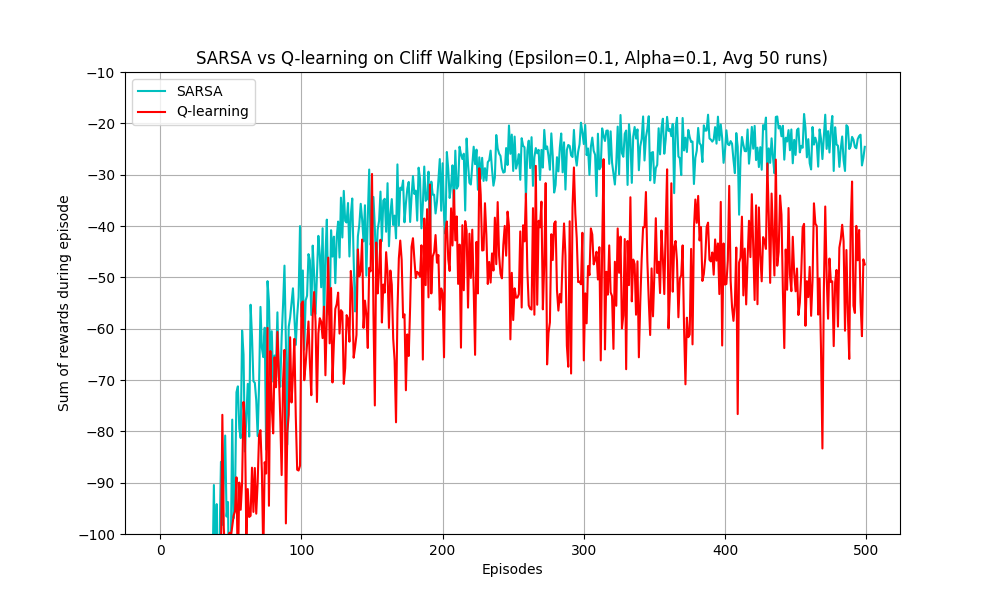
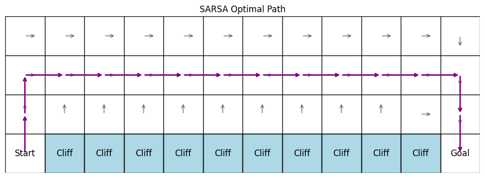
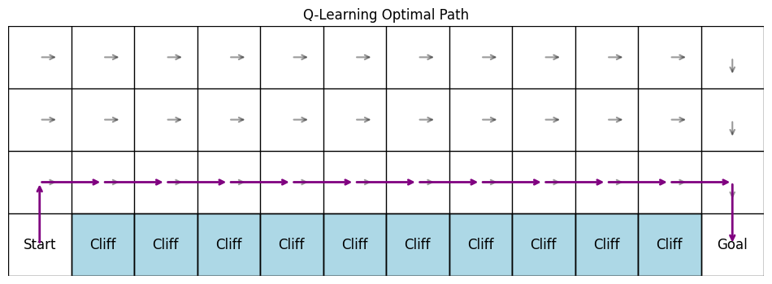

# 強化學習作業：Q-learning 與 SARSA 在 Cliff Walking 的比較

## 一、作業目的
本作業旨在實作並比較兩種經典強化學習演算法——Q-learning（離策略）與 SARSA（同策略）。透過在「Cliff Walking」（懸崖漫步）環境中使用相同的超參數設定，觀察並分析這兩種演算法的學習行為、收斂特性，以及最終收斂策略的差異。

## 二、環境描述
本實驗依據 Sutton & Barto 強化學習教科書中經典的 **Cliff Walking（懸崖漫步）** 環境，其設定如下：
* **網格大小**：4 × 12 的矩形網格世界。
* **起點 (Start)**：位於左下角 `(3, 0)`。
* **終點 (Goal)**：位於右下角 `(3, 11)`。
* **懸崖 (Cliff)**：起點與終點之間的整個底部區域 `(3, 1)` 到 `(3, 10)` 皆為懸崖。
* 當 agent 移動並踏入懸崖區域時，將會獲得極大的負獎勵 (-100)，並且立刻被傳送回「起點」。

## 三、問題設定
* **狀態空間 (State Space)**：所有網格位置，共 48 個狀態。
* **動作空間 (Action Space)**：上 (Up)、下 (Down)、左 (Left)、右 (Right) 共 4 個動作。
* **獎勵機制 (Reward)**：
    * 每移動一步（常規步驟）：`-1`
    * 掉入懸崖 (Cliff)：`-100`，並立刻回到起點
    * 到達終點 (Goal)：到達後回合結束（該步依然為常規扣分 `-1`）。
* **策略 (Policy)**：採用 $\epsilon$-greedy 策略作為探索與利用的平衡。
* **實驗參數設定**：
    * **學習率 ($\alpha$)**：0.1
    * **隨機探索率 ($\epsilon$)**：0.1
    * **折扣因子 ($\gamma$)**：0.9
    * **訓練回合數 (Episodes)**：500 回合
    * （註：圖表結果經過 50 次獨立運作取平均，以消除隨機震盪使曲線清晰可見）

## 四、作業內容

### （一）演算法實作與（二）訓練過程
本實驗採用 Python (NumPy) 實作 Q-learning 與 SARSA。
兩種演算法在每一回合剛開始時，皆從起點出發。透過 $\epsilon$-greedy 選取動作並與環境互動，直至進入終點完成回合。

* Q-learning 更新式：$Q(S, A) \leftarrow Q(S, A) + \alpha [R + \gamma \max_a Q(S', a) - Q(S, A)]$
* SARSA 更新式：$Q(S, A) \leftarrow Q(S, A) + \alpha [R + \gamma Q(S', A') - Q(S, A)]$

### （三）結果分析

#### 1. 學習表現 (Learning Performance)

* **收斂速度**：從以上的學習曲線圖中可看出，雙方在早期 20-50 回合內就迅速抵達了各自的表現下限。但在回合初期的爬升階段，SARSA 的分數爬升相當快且穩步向上逼近較高的總獎勵；反觀 Q-learning 因為固守懸崖邊緣的最佳路徑，不斷因 $\epsilon$-greedy 的隨機動作跌落懸崖，因此其總獎勵的分數一直在 -40~-60 附近來回徘徊。
* **累積獎勵比較**：SARSA 收斂後的平均每回合獎勵大約在 **-20 到 -25** 區間內跳動；而 Q-learning 的平均回合獎勵則只有 **-50 左右**。從「訓練過程的實際得分」來看，SARSA 是遠遠勝出 Q-learning 的。

#### 2. 策略行為 (Policy Behavior)

我們將演算法收斂後獲取的 Q-table 以純 Greedy（即 $\epsilon=0$）的方式列印出最佳路徑：

**SARSA: 傾向保守 (Conservative / Safe Path)**

因為 SARSA 的更新會將**下一階段採用 $\epsilon$-greedy 所產生的實際行為**納入考量，它發現「只要我把路徑排在懸崖邊，我就有 10% 機率不小心掉下去承受 -100 慘痛代價」。所以為了讓整體預期期望值最大化，它學到的路徑會主動往上繞遠路，這是一種非常**保守、安全但步數略多**的策略。

**Q-learning: 傾向冒險 (Risky / Optimal Path)**

由於 Q-learning 在更新 $Q(S, A)$ 時使用的是 **下一個狀態的絕對最優動作 ($\max_a Q(S', a)$)**，它總是假設自己在下期絕對不會失誤，並完全「無視」了執行策略實際可能帶來的隨機風險。因此它學到的就是純理論上步數最少、最直接的**最佳路徑**（緊貼著懸崖邊）。這是一個典型的**冒險策略**，若環境後續依舊有隨機噪音，它必定會經常失足落崖。

#### 3. 穩定性分析 
* **波動程度**：SARSA 的曲線整體十分平穩、震盪性小，因為一旦學到了安全遠離懸崖的策略後，即使 $\epsilon$ 所帶來的隨機動作也只會在安全平地上進行，導致 -1 的步數懲罰波動。
* **探索的影響**：相對地，Q-learning 受到探索機率的嚴重打擊。雖然預期分數很高，但現實因為 10% 的隨機步而頻頻摔落谷底，這導致在整整 500 個 episodes 中，Q-learning 的獎勵曲線始終伴隨著大量震盪，因此在實際探索策略下穩定性遠不如 SARSA。

## 五、理論比較與討論

* **Q-learning 為離策略 (Off-policy)**：Q-learning 用於更新的下一個行動是用貪婪法則找出來的「理想最佳行動」，這個行動跟它實際上透過 $\epsilon$-greedy 在環境裡面遊走的行動是「脫鉤」的。既然評估策略與行動策略不同，它當然不會把探索的風險涵蓋進來。
* **SARSA 為同策略 (On-policy)**：SARSA 用於更新的下一個行動完全是它在下一步真實實踐的動作。這表示 SARSA 的評估與行動是「綁定」的。既然模型每步有機率亂走，SARSA 就將亂走帶來的懲罰誠實地反映在 Q-value 裡面，迫使模型只能退而尋求更安全的繞遠路選擇。
* **綜合觀點**：Q-learning 追求的是一種排除雜訊的「終極理論最佳解方案」，而 SARSA 追求的則是「包含現有雜訊下的最佳實際折衷方案」。

## 六、結論要求

1. **哪一種方法收斂較快？**
   在純理論的最佳路徑方面，**Q-learning** 可以較快鎖定最佳解路徑；但在「訓練期間獎勵表現的收斂性與減少錯誤頻率」上，**SARSA** 初期很快就學到了規避危險的高分路線，因此觀察訓練過程的學習曲線收斂性，SARSA 顯得較快且乾淨俐落。

2. **哪一種方法較穩定？**
   **SARSA** 更加穩定。因為它選擇了遠離極端懲罰的情境，大幅減少了不小心遭受極端扣分的機率，讓整體過程與最終學習路線都相對受控無波動。

3. **在何種情境下應選擇 Q-learning 或 SARSA？**
   * **選擇 SARSA 的情境**：訓練錯估的成本非常龐大、難以承受且不可逆轉時。例如：**自動駕駛、機器狗步伐訓練、昂貴之機械手臂、真實世界的金融交易決策系統** 等，這些領域都需要演算法以「最安全、防碰撞、能適應隨機雜訊」的方式收斂並尋找次佳但保底的路徑。
   * **選擇 Q-learning 的情境**：在容忍大量犯錯的**模擬/虛擬環境中**進行閉門訓練，且預期訓練結束後實際部署時不存在強烈隨機性（能將探勘率關閉）。例如：**棋盤遊戲（AlphaGo的基礎訓練）、影像辨識策略優化、排程優化**等。 Q-learning 可以幫助我們不管中間犯多少錯，最終都找出最極限完美的操作。
